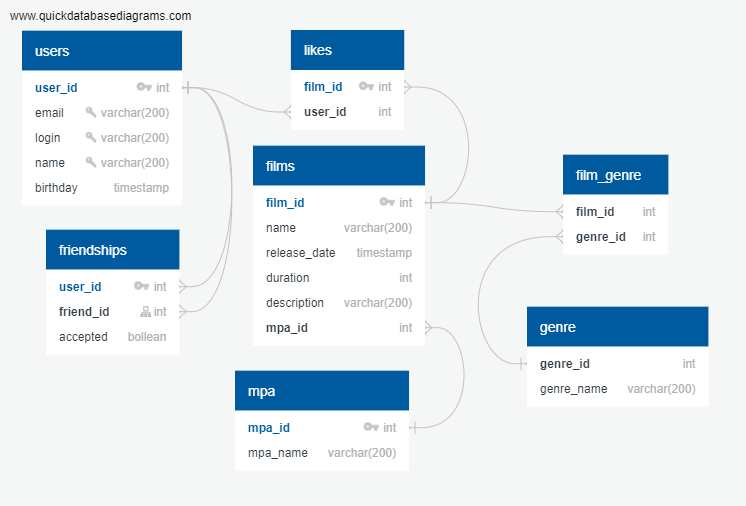

# java-filmorate
## Краткое описание БД - из каких таблиц и представлений состоит.

## Пояснение

#### Таблица users

Таблица содержит список пользователей приложения.
Каждый пользователь идентифицируется целочисленным идентификатором (user_id).
Поля электронная почта (email), логин (login), 
дата рождения (birthday)- обязательно должны содержать данные.
В поле дата рождения (birthday) входит только дата (тип данных date).

#### Таблица films

Таблица содержит список фильмов.
Каждый фильм идентифицируется целочисленным идентификатором (film_id).
Поля название (name), описание (description), продолжительность фильма (duration) и Идентификатор рейтинга (mpa_id) - обязательно должны содержать данные. Поле (release_date) - обязательно для заполнения. Максимальная длина описания — 200 символов.

#### Таблица genre

Таблица содержит список жанров фильма. Каждый жанр идентифицируется целочисленным идентификатором (genre_id).
Поле название жанра (genre_name) - обязательно для заполнения.
Список возможных значений:

* Комедия.
* Драма.
* Мультфильм.
* Триллер.
* Документальный.
* Боевик.

#### Таблица mpa

Таблица содержит список рейтингов Ассоциации кинокомпаний.
Каждый рейтинг идентифицируется целочисленным идентификатором (mpa_id).
Поле mpa_name - обязательно для заполнения.
Эта оценка определяет возрастное ограничение для фильма. Значения могут быть следующими:

* G — у фильма нет возрастных ограничений,
* PG — детям рекомендуется смотреть фильм с родителями,
* PG-13 — детям до 13 лет просмотр не желателен,
* R — лицам до 17 лет просматривать фильм можно только в присутствии взрослого,
* NC-17 — лицам до 18 лет просмотр запрещён.

#### Таблица user_friends

Таблица содержит список друзей пользователя и статус подтверждения дружбы.
Данная таблица связывает идентификаторы пользователей из таблицы users, которые подали заявку в друзья. Каждая пара user_id - friend_id является уникальной. С помощью данной таблицы можно получить список общих друзей с другим пользователем.

#### Таблица film_genre

С помощью данной таблицы связывается идентификаторы таблиц films и genre. Каждая пара в таблице должна быть уникальна.

#### Таблица film_likes

С помощью данной таблицы связывается идентификаторы таблиц films и users. Каждая пара в таблице должна быть уникальна.
